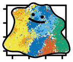
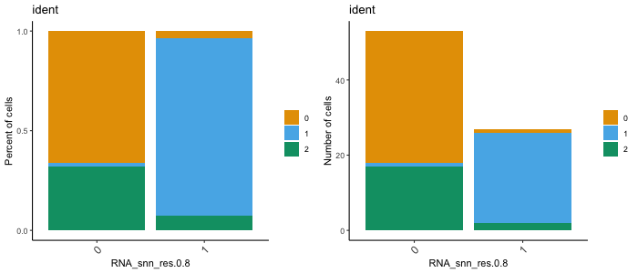
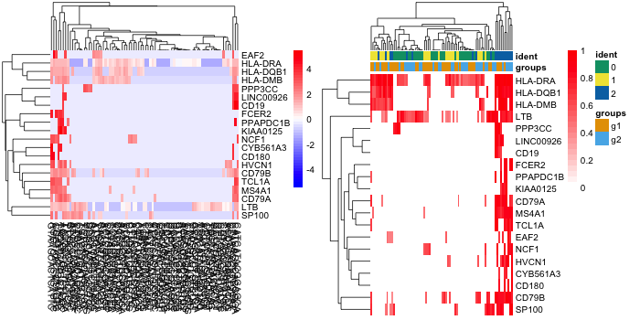
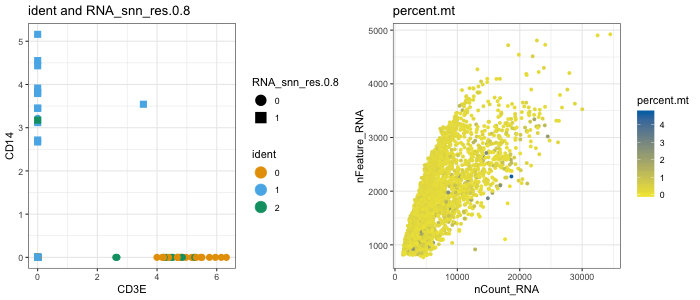
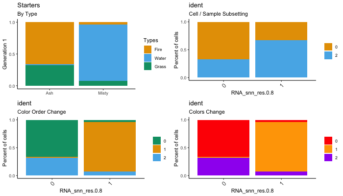

# dittoSeq 

**A set of functions built to enable analysis and visualization of single-cell and bulk RNA-sequencing data by novice, experienced, and color blind coders**

dittoSeq includes universal plotting and helper functions for working with (sc)RNAseq data processed in these packages:

- Seurat (versions 2 & 3, single-cell RNAseq)
- SingleCellExperiment (single-cell RNAseq)
- DESeq2 (bulk RNAseq)
- edgeR (bulk RNAseq)
- Limma-Voom (bulk RNAseq)
- (Compatibility is planned for Monocle in a future version.)

All plotting functions spit out easy-to-read, color blind friendly, plots (ggplot2, plotly, or pheatmap) upon minimal coding input for your daily analysis needs, yet also allow sufficient manipulations to provide for out-of-the-box submission-quality figures!

dittoSeq also makes collection of underlying data easy, for submitting to journals, with `data.out = TRUE` inputs!


Additionally, contains import functions for [Demuxlet](https://github.com/statgen/demuxlet) cell annotations as Mux-seq datasets often consist of side-by-side bulk and single-cell RNAseq.  (If you would like a pipeline for extraction of genotypes from bulk RNAseq to enable Demuxlet-calling of single-cell RNAseq, shoot me an email.)

## Installataion:

```
devtools::install_github("dtm2451/dittoSeq")

# For stable pre-bioconductor submission version:
devtools::install_github("dtm2451/dittoSeq@v0.3")

# For older versions:
#   Old DB plotter version
# devtools::install_github("dtm2451/dittoSeq@v0.2")
#   Old DB plotter version plus some early ditto plotters
# devtools::install_github("dtm2451/dittoSeq@v0.2.20")
```


## News: dittoSeq is being submitted to Bioconductor!

- Version 0.3.0 is being up'd to 0.99.0 for that purpose.
- Changes are expected, so I will maintain the current 0.3 version throughout.
- Changes in 0.3 -> 0.99:
  - Helper function names changed from `get.X` and `is.X` to `getX` and `isX`

## News: version 0.3.0 is LIVE

**Includes lots of new features!**

- Compatibility with bulk RNAseq data that was processed with edgeR & limma-voom.
- `dittoScatterPlot()` which allows plotting of gene x gene / metadata x metadata / gene x metadata.  Great for examining raw droplet data QC, or potential marker gene RNA or CITE-seq expression.
- `dittoDimPlot` now supports overlay of pseudotime-analysis trajectory paths.
- Retrieval of underlying data as a dataframe or matrix.  Just add `data.out = TRUE` to the call.
- Many more!

**Other updates since version 0.2:**

- Documentation overhaul for most functions with plenty of example code added.
- The package is now camelCase, **d**ittoSeq, to go along with typical conventions.
- Visualization names all start with `ditto...` and `multi_ditto...` instead of `DB...` and `multiDB...` Example: `dittoDimPlot` and `multi_dittoDimPlot`.
- Color Storage: The colors are now retrievable with a simple, empty, function call, `dittoColors()`.  For use outside of dittoSeq, simply use `dittoColors()`.  Example within dittoSeq: `dittoDimPlot("ident", seurat, color.panel = dittoColors() )`.

## Color blindness friendliness:

The default colors of this package are meant to be color blind friendly.  To make it so, I used the suggested colors from this source: [Wong B, "Points of view: Color blindness." Nature Methods, 2011](https://www.nature.com/articles/nmeth.1618) and adapted them slightly by appending darker and lighter versions to create a 24 color vector. All plotting functions use these colors, stored in `dittoColors()`, by default. Also included is a Simulate() function that allows you to see what your function might look like to a colorblind individual. For more info on that, see my [Colorblindness Compatibility Page](ColorblindCompatibility)

# Quick Start Guide:

```
# Install
devtools::install_github("dtm2451/dittoSeq")
# (Be sure to restart after a re-install!)
```

```
# For stable pre-bioconductor submission version:
# devtools::install_github("dtm2451/dittoSeq@v0.3")

# For older versions:
#   Old DB plotter version
# devtools::install_github("dtm2451/dittoSeq@v0.2")
#   Old DB plotter version plus some early ditto plotters
# devtools::install_github("dtm2451/dittoSeq@v0.2.20")
```

Load in your data, then go!:

```
library(dittoSeq)
# library(Seurat)

# For working with scRNAseq data, works directly with Seurat and SingleCellExperiment objects
seurat <- Seurat::pbmc_small
dittoPlot("CD14", seurat, group.by = "ident")

sce <- Seurat::as.SingleCellExperiment(seurat)
dittoBarPlot("ident", sce, group.by = "RNA_snn_res.0.8")

# For working with bulk RNAseq data, first load your data into a format that dittoSeq quickly understands
# deseq2 <- importDESeq2()
# edger <- importEdgeR()
# limma.voom <- importEdgeR()
myRNA <- RNAseq_mock
dittoDimPlot("Gene1", myRNA, size = 3)
```

Quickly determine the metadata and gene options for plotting with universal helper functions:

```
getMetas(seurat)
isMeta("nCount_RNA", seurat)

getGenes(myRNA)
isGene("CD3E", myRNA)

getReductions(sce)

# View them with these:
gene("CD3E", seurat, data.type = "raw")
meta("groups", seurat)
meta.levels("groups", seurat)
```

### There are many dittoSeq Plot Types

**Intuitive default adjustments generally allow creation of immediately useable plots.**

```
# dittoDimPlot
dittoDimPlot("ident", seurat, size = 3)
dittoDimPlot("CD3E", seurat, size = 3)
```


```
# dittoBarPlot
dittoBarPlot("ident", seurat, group.by = "RNA_snn_res.0.8")
dittoBarPlot("ident", seurat, group.by = "RNA_snn_res.0.8",
    scale = "count")
```



```
# dittoPlot
dittoPlot("CD3E", seurat, group.by = "ident")
dittoPlot("CD3E", seurat, group.by = "ident",
    plots = c("boxplot", "jitter"))
dittoPlot("CD3E", seurat, group.by = "ident",
    plots = c("ridgeplot", "jitter"))
gridExtra::grid.arrange(grobs = list(p1,p2,p3))
```


```
# dittoHeatmap
dittoHeatmap(genes = getGenes(seurat)[1:20], seurat)
dittoHeatmap(genes = getGenes(seurat)[1:20], seurat,
    annotation.metas = c("groups", "ident"),
    scaled.to.max = TRUE,
    show.colnames = FALSE)
# Turning off cell clustering can be necessary for many cell scRNAseq
dittoHeatmap(genes = getGenes(seurat)[1:20], seurat,
    cluster_cols = FALSE)
```



```
# dittoScatterPlot
dittoScatterPlot(
    x.var = "CD3E", y.var = "nCount_RNA",
    color.var = "ident", shape.var = "RNA_snn_res.0.8",
    object = seurat,
    size = 3)
dittoScatterPlot(
    x.var = "nCount_RNA", y.var = "nFeature_RNA",
    color.var = "percent.mt",
    object = sce,
    size = 1.5)
```



```
# Also multi-plotters:
    # multi_dittoDimPlot (multiple, in an array)
    # multi_dittoDimPlotVaryCells (multiple, in an array, but showing only certain
    #     cells in each plot)
    # multi_dittoPlot (multiple, in an array)
    # dittoPlot_VarsAcrossGroups (multiple genes or metadata as the jitterpoints (and
    #     other representations), summarized across groups by mean, median, ..., )
```

**Many adjustments can be made with simple additional inputs:**

Many adjustments to how data is reresented are within the examples above.  See documentation for more!  Also,

- DEFAULTing: Set `DEFAULT <- object_name` to elinate the need to type `object = object_name` except when switching between multiple objects.
- All Titles are adjustable.
- Easily subset the cells shown with 
- Colors can be adjusted easily.
- Underlying data can be output.
- plotly hovering can be added.
- Many more! (Legends removal, label rotation, labels' and groupings' names, ...)

```
# Set default
DEFAULT <- "seurat"

# Adjust titles
dittoBarPlot("ident", group.by = "RNA_snn_res.0.8",
    main = "Starters",
    sub = "By Type",
    xlab = NULL,
    ylab = "Generation 1",
    x.labels = c("Ash", "Misty"),
    legend.title = "Types",
    var.labels.rename = c("Fire", "Water", "Grass"),
    x.labels.rotate = FALSE)

# Subset cells / samples
dittoBarPlot("ident", group.by = "RNA_snn_res.0.8",
    cells.use = meta("ident")!=1)

# Adjust colors
dittoBarPlot("ident", group.by = "RNA_snn_res.0.8",
    colors = c(3,1,2)) #Just changes the color order, probably most useful for dittoDimPlots
dittoBarPlot("ident", seurat, group.by = "RNA_snn_res.0.8",
    color.panel = c("red", "orange", "purple"))
```



```
# Output data
dittoBarPlot("ident", group.by = "RNA_snn_res.0.8",
    data.out = TRUE)

# Add plotly hovering
dittoBarPlot("ident", group.by = "RNA_snn_res.0.8",
    do.hover = TRUE)
```
